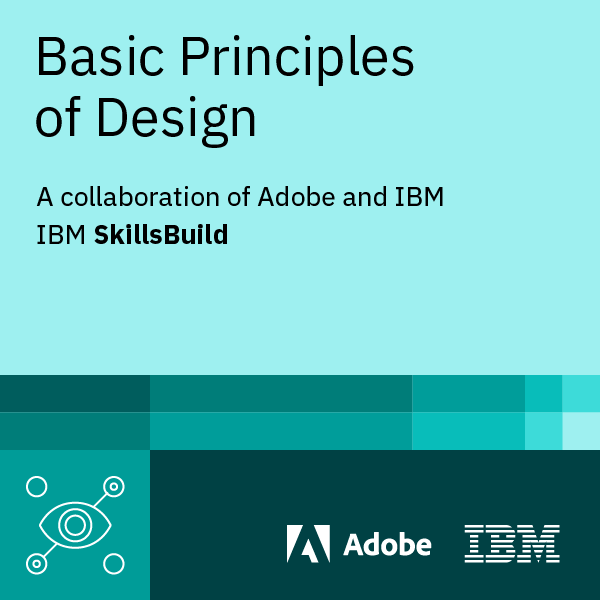

<h1 align="left">Olá 👋 Tudo bem?</h1>

###

<strong>Meu nome é Matheus, sou instrutor de TI.</strong>

###

<h2 align="left">Skills</h2>

###

  
  
  
  
  
  
  
  
  
  
  
  
  
  
  
  
  

<h2 align="left">Skills Beads</h2>

<strong>Hello World!!</strong>

###
